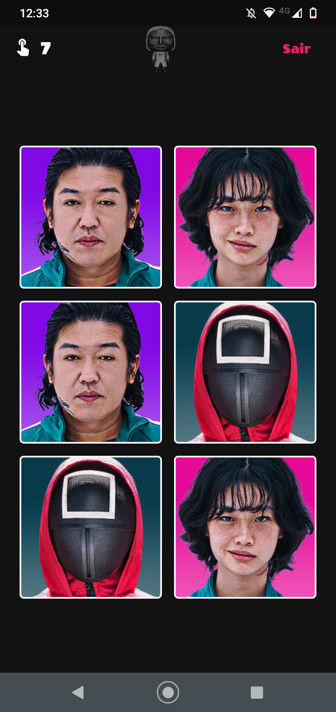
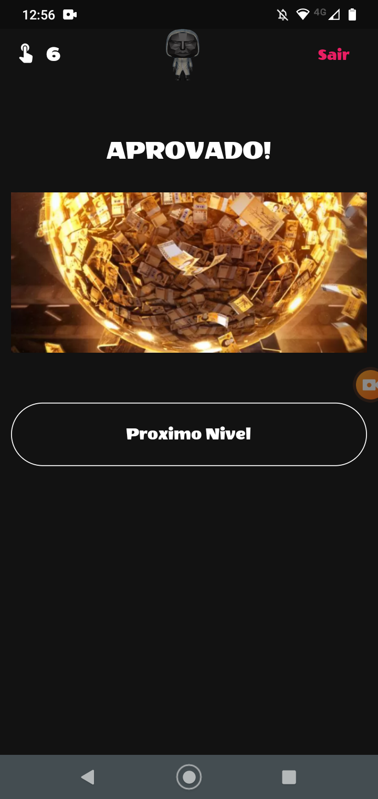
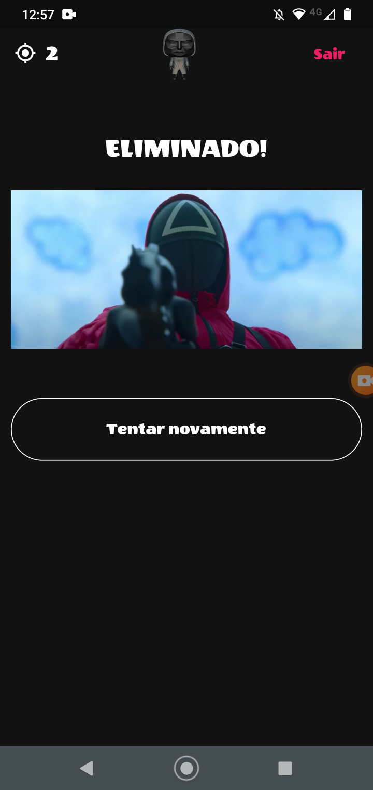

# Jogo_Da_Memoria
 Jogo da Memoria em Flutter com o tema da série Round 6
 
# Status
 🟢 Concluido
 
 # 🔨 Ferramentas usadas
<ul>
 <li> Animation Controller </li>
 <li> Enum </li>
 <li> Google Fonts </li>
 <li> MobX </li>
 <li> Provider </li>
 <li> Banco de Dados Hive</li>
</ul>

# imagens do App

 
  
  
  
  
  
  
  
  
  

